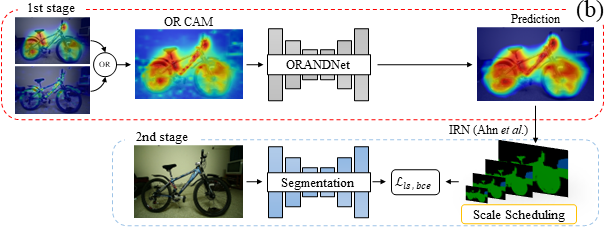
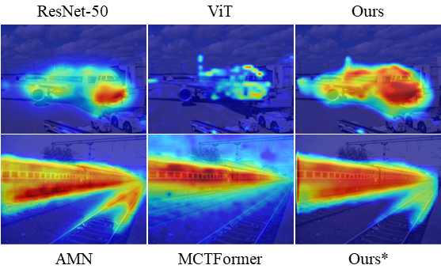

# Precision Matters: Precision-aware Ensemble for Weakly Supervised Semantic Segmentation (Accepted in AAAI EIW 2024)

[](https://paperswithcode.com/sota/weakly-supervised-semantic-segmentation-on-1?p=precision-matters-precision-aware-ensemble)

[](https://paperswithcode.com/sota/weakly-supervised-semantic-segmentation-on?p=precision-matters-precision-aware-ensemble)


## Abstract





Weakly Supervised Semantic Segmentation (WSSS) employs weak supervision, such as image-level labels, to train the segmentation model. Despite the impressive achievement in recent WSSS methods, we identify that introducing weak labels with high mean Intersection of Union (mIoU) does not guarantee high segmentation performance. Existing studies have emphasized the importance of prioritizing precision and reducing noise to improve overall performance. In the same vein, we propose ORANDNet, an advanced ensemble approach tailored for WSSS. ORANDNet combines Class Activation Maps (CAMs) from two different classifiers to increase the precision of pseudo-masks (PMs). 
To further mitigate small noise in the PMs, we incorporate curriculum learning. This involves training the segmentation model initially with pairs of smaller-sized images and corresponding PMs, gradually transitioning to the original-sized pairs.
By combining the original CAMs of ResNet-50 and ViT, we significantly improve the segmentation performance over the single-best model and the naive ensemble model, respectively. We further extend our ensemble method to CAMs from AMN (ResNet-like) and MCTformer (ViT-like) models, achieving performance benefits in advanced WSSS models. It highlights the potential of our ORANDNet as a final add-on module for WSSS models.


## Dependencies

```
conda create -n wsss python=3.6
conda install pytorch==1.12.1 torchvision==0.13.1 torchaudio==0.12.1 cudatoolkit=11.6 -c pytorch -c conda-forge
sudo apt-get remove cython && pip3 install --force-reinstall cython==0.29.36 && \
python -m pip install opencv-python==4.6.0.66 && \
pip install pillow timm grad-cam scikit-learn imageio tqdm && \
pip3 install --no-build-isolation git+https://github.com/lucasb-eyer/pydensecrf.git
```


## Results

| Method        | Val  | Test |
|---------------|------|------|
| ORANDNet          | 70.3 | 72.1 |
| ORANDNet(MCTFormer + AMN) | 72.2 | 72.9 |


## Acknowledgement

This code is highly borrowed from [PSA](https://github.com/jiwoon-ahn/psa). Thanks to Jiwoon, Ahn. Also, This work was done with great help from the members of the CVML Lab. Thanks to the members of the CVML Lab.
